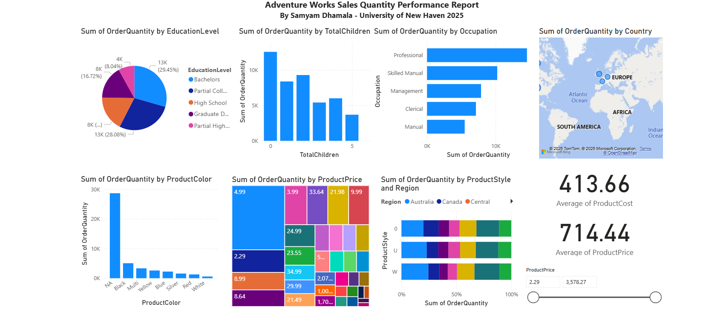

AdventureWorks Sales Dashboard

This project uses the AdventureWorks dataset (four CSV files) to build a relational data model in Power BI and design an interactive sales report in the Power BI Service (Office 365).

📊 Key Features
Data Modeling

Imported four datasets into Power BI Desktop.

Created relationships between tables (CustomerKey, ProductKey, TerritoryKey).

Published the model to Power BI Service (My Workspace) as a semantic model.

Report Development

Built a new report in Power BI Service using the published semantic model.

Designed visuals to highlight sales and customer insights (mirroring provided design mockups).

Customized formatting and layout for clarity and professional presentation.

Added dynamic text elements (e.g., name personalization).

🛠 Skills Demonstrated

Data modeling & relationships in Power BI

Publishing semantic models to Power BI Service

Report creation directly in the cloud environment

Visual storytelling with clean design & formatting

📷 Dashboard Preview
